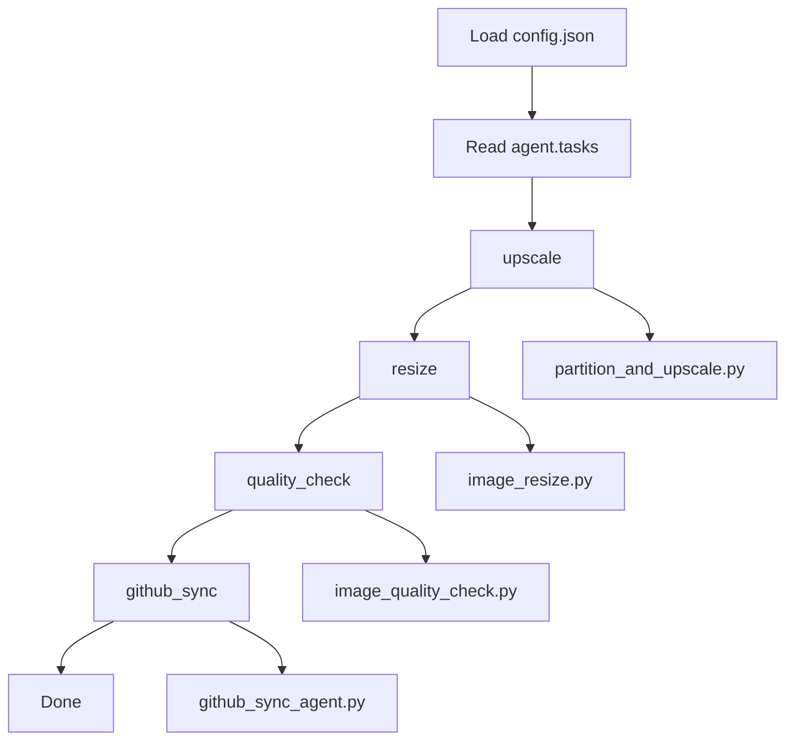

# Image Resolution Using Agentic Workflow

A configurable image-processing pipeline for upscaling, resizing, quality checks, and GitHub synchronization.

This project combines script-based image processing with an orchestration layer that behaves like an agent: it reads a central config, executes tasks in sequence, and can sync code to GitHub on each run.

## Key Features

- Centralized configuration in one file: `config.json`
- Tile-based large-image upscaling with Real-ESRGAN executable
- Optional quality checks (dimension comparison and edge visualization)
- Unit-aware resize support (`pixels`, `cm`, `inches`)
- Uncompressed image conversion utility
- Workflow orchestrator (`workflow_agent.py`) to run tasks in order
- GitHub sync automation (`github_sync_agent.py`) with commit and push flow

## Project Structure

```text
Image_resolution_using_agents/
  config.json                    # Central config for all paths, params, task order
  config_loader.py               # Shared config/path resolver
  workflow_agent.py              # Orchestrator agent
  github_sync_agent.py           # GitHub sync tool-wrapper agent

  main.py                        # Image details + uncompressed size estimator
  image_resize.py                # Resize logic (pixels/cm/inches)
  image_quality_check.py         # Dimensional + edge comparison
  partition_and_upscale.py       # Tile split/upscale/merge pipeline
  uncompressed_image.py          # Convert image to uncompressed format

  images/
    original/

  exe/
    realesrgan-ncnn-vulkan-20220424-windows/
      realesrgan-ncnn-vulkan.exe
      models/
```

## Workflow Structure

The runtime behavior is controlled by `agent.tasks` in `config.json`.

Current default task order:

1. `upscale`
2. `resize`
3. `quality_check`
4. `github_sync`

### Execution Graph



## How the Agentic Layer Works

### Orchestrator Agent

`workflow_agent.py` acts as the orchestrator:

- Loads the central config
- Resolves relative paths safely
- Dispatches each task by name
- Passes per-task settings from config

### Tool Agents

- `github_sync_agent.py`: asks for repository link + commit message, commits and pushes.
- Processing scripts (`partition_and_upscale.py`, `image_resize.py`, etc.) are callable tools used by the orchestrator.

This creates a simple agentic pattern:

- plan (task list in config)
- execute (run task handlers)
- report (console output and git state)

## Central Configuration (`config.json`)

Main sections:

- `paths`: all input/output/executable paths
- `image_details`: print DPI context
- `resize`: width, height, unit, output name
- `quality_check`: optional edge view toggle
- `upscale`: tile size, overlap, merge method, model, scale
- `agent`: task sequence
- `git`: default repository link and visibility

Example task sequence:

```json
"agent": {
  "tasks": ["upscale", "resize", "quality_check", "github_sync"]
}
```

## Setup

## 1) Prerequisites

- Python 3.9+
- Git
- Real-ESRGAN Windows executable already present in:
  - `exe/realesrgan-ncnn-vulkan-20220424-windows/`

## 2) Install Python dependencies

```bash
pip install pillow numpy matplotlib opencv-python
```

## 3) Configure values

Edit `config.json`:

- Update image paths under `paths`
- Set desired model and upscale options under `upscale`
- Set task order under `agent.tasks`
- Optionally set `git.default_repo_link`

## Usage

## Run full workflow (recommended)

```bash
python workflow_agent.py --config config.json
```

## Run individual tools

```bash
python partition_and_upscale.py --config config.json
python image_resize.py --config config.json
python image_quality_check.py --config config.json
python uncompressed_image.py --config config.json
python main.py --config config.json
python github_sync_agent.py
```

## GitHub Sync Behavior

`github_sync_agent.py` performs:

1. Prompt for repository link (uses default if configured)
2. Prompt for visibility (`private`/`public`)
3. Prompt for commit message
4. Stage and commit changed files
5. Ensure remote `origin` is set
6. Push to remote branch

If tracked files exceed GitHub size limits, sync is blocked with a clear error.

## Large File Guidance

GitHub rejects single files larger than 100 MB in standard Git.

Recommended:

- Keep large generated artifacts out of Git via `.gitignore`
- Use Git LFS for assets that must be versioned

## Troubleshooting

## Push fails with size error

- Remove large file from tracking:
  - `git rm --cached <path>`
- Add path to `.gitignore`
- Amend or create a new commit
- Push again (force push may be needed if history was rewritten)

## No changes to commit

- This means working tree is clean; push may still run but no new commit is created.

## Path issues on Windows

- Keep relative paths in `config.json`
- Run commands from project root

## Suggested Next Improvements

1. Add structured run logs (`logs/<run_id>.json`)
2. Add retries and failure policy per task
3. Add objective quality metrics (PSNR/SSIM)
4. Add a dry-run mode for workflow validation
5. Add CI pipeline for lint/test/push checks
